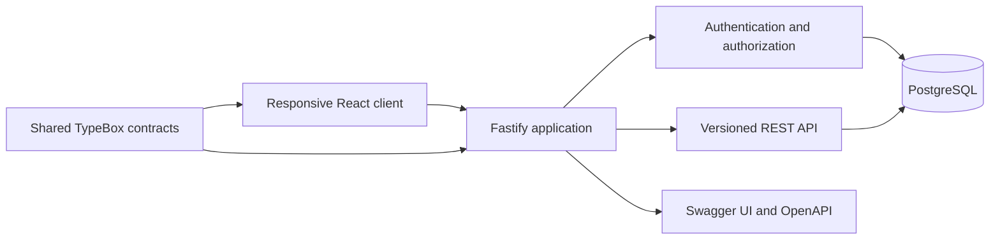

# Architecture

## Boundaries

- `client` owns interaction, responsive layout, and session bootstrap. It never decides resource ownership.
- `server` owns password verification, cookie issuance, session revocation, and resource scoping.
- `packages/contracts` owns public role and API schemas. Server responses are serialized from those schemas.
- `data/reference` holds immutable source records. The seed imports them idempotently through committed migrations.

The Stage 1 production app serves the built client and `/api/v1` from one origin. The client uses an HttpOnly, SameSite cookie. Mutating requests with an Origin header must match `APP_ORIGIN`. The server checks the session table on every authenticated request so logout can revoke a token immediately.

The data schema and domain services support orders, planning, loading, delivery, receipt, proof, claims, offline command replay, and return closure. Fastify workflow routes expose typed TypeBox contracts. Role checks derive depot/outlet scope from the authenticated database session. Assisted allocation creates editable drafts; release reruns authoritative feasibility checks. Forecast inference is explicitly unavailable until a model is connected.

Domain services live in `server/src/modules/operations`; `operations/api.ts` exposes role-scoped command and query endpoints. Plan release revalidates assignments, published travel references, driver/vehicle overlap and weekly fuel before committing manifests. Delivery proof is authenticated, checksummed, and stored on a private Docker volume; no cloud credentials are required. Each offline event is independently idempotent and returns a durable result or conflict. Compose runs PostgreSQL 16, a one-shot Drizzle migration service, and the application. Demo seeding is an explicit profile. Browser UI integration and durable browser outbox remain separate client work.
