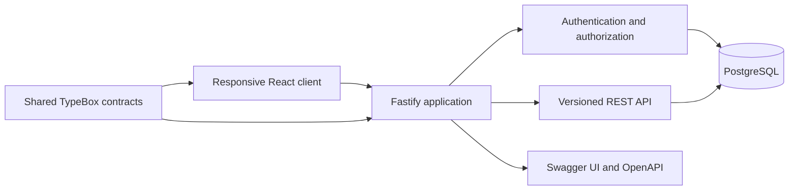

# Architecture

## Boundaries

- `client` owns interaction, responsive layout, and session bootstrap. It never decides resource ownership.
- `server` owns password verification, cookie issuance, session revocation, and resource scoping.
- `packages/contracts` owns public role and API schemas. Server responses are serialized from those schemas.
- `data/reference` holds immutable source records. The seed imports them idempotently through committed migrations.

The Stage 1 production app serves the built client and `/api/v1` from one origin. The client uses an HttpOnly, SameSite cookie. Mutating requests with an Origin header must match `APP_ORIGIN`. The server checks the session table on every authenticated request so logout can revoke a token immediately.

The data schema and transaction helpers support workflows for: orders, planning, loading, delivery, receipt, and forecasting. Authorization combines role checks with depot, outlet, or plan ownership in database queries. The allocation engine will be tested against the supplied `check_allocation.py` semantics, including combined vehicle day budgets.

Operational transaction helpers live in `server/src/modules/operations`. Plan release locks and revalidates assignments and weekly fuel budgets before committing manifests. Loading, delivery, receipt, and synchronization helpers preserve distinct requested and actual quantities. These helpers are backend interfaces for later HTTP routes and operational screens. Infrastructure remains Docker Compose with PostgreSQL 16; schema changes use committed Drizzle migrations.
