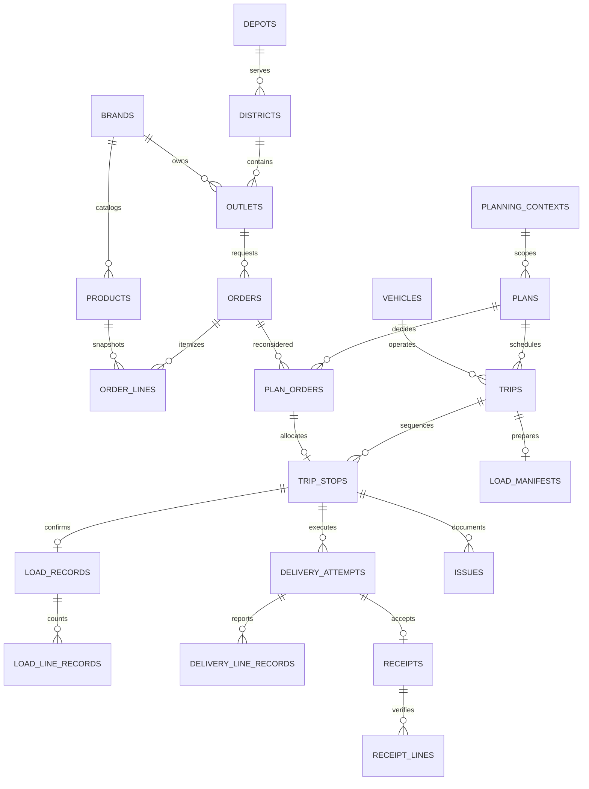

# Waypoint relational data model

PostgreSQL 16 is the source of truth. Drizzle defines the typed schema and committed migrations;
Docker Compose owns the database and application infrastructure. No native PostgreSQL service,
schema push, or database reset is part of setup.

## Workflow and ownership

District/brand clusters are queries over eligible orders, not persisted entities. A trip owns
its vehicle, driver, assignments and delivery sequence. A **load manifest has the trip's primary
key** and owns loading progress, bay, sign-off and departure authorization. Its contents and
reverse loading sequence are derived from trip stops; there is no duplicate load assignment table.

A vehicle's second trip has its own manifest. One order is one delivery stop, including when two
orders share an outlet. This matches the supplied allocation/time-budget semantics.

## Entity dictionary

| Area         | Tables and responsibilities                                                                                                                                                                                                                                                                   |
| ------------ | --------------------------------------------------------------------------------------------------------------------------------------------------------------------------------------------------------------------------------------------------------------------------------------------- |
| Network      | `depots`, `brands`, `districts`, `outlets`: a district has one serving depot; outlets derive their depot. Windows are native `time`, with separate mall opening/closing fields.                                                                                                               |
| Fleet        | `vehicles`: physical capabilities, home depot, efficiency, default weekly quota and active flag. `vehicle_availability`: dated/scenario availability, including workshop exclusion.                                                                                                           |
| Identity     | `users`, `sessions`: role, staff depot or store outlet, active accounts and revocable sessions. Dispatcher has access to both depots.                                                                                                                                                         |
| Catalog      | `products`: unique SKU, brand, ordering unit, temperature, positive unit dimensions and optional estimated LKR value. Demo SKUs are explicitly synthetic.                                                                                                                                     |
| Ordering     | `orders`: public reference, outlet, format, temperature, requested/eligible dates and lifecycle. `order_lines`: quantities and product snapshots frozen at submission. `order_aggregates`: supplied totals for aggregate imports only.                                                        |
| Provenance   | `import_batches`: dataset/version/checksum identity. `order_sources`: batch/scenario/source reference, original row position, priority flags and original source context. Source context JSON is immutable-input metadata, not operational relationships.                                     |
| Planning     | `planning_contexts`: live date or isolated scenario/date. `plans`: one context/depot plan, version, release state and policy notes. `plan_orders`: dated allocation/deferral decisions, reasons and next operating date.                                                                      |
| Routing      | `trips`: vehicle, driver, brand, district and trip number 1/2. `trip_stops`: assignment, sequence, planned leg timings, service allowance and window/access snapshots. Composite foreign keys prevent cross-plan or cross-order references.                                                   |
| Fuel         | `vehicle_week_budgets`: namespace/vehicle/Monday key, quota snapshot and opening usage. `trip_fuel_reservations`: per-trip reserved/consumed fuel; actual usage replaces its estimate when supplied.                                                                                          |
| Loading      | `load_manifests`, `load_records`, `load_line_records`: manifest state, per-order confirmation, actual quantities and measured temperature. `trip_inspections`: driver, odometer and fuel/chiller checks.                                                                                      |
| Fulfillment  | `delivery_attempts`, `delivery_line_records`: arrival, completion, receiver and quantities. `receipts`, `receipt_lines`: independent store sign-off and accepted/missing/damaged/rejected counts.                                                                                             |
| Claims       | `issues`: loading/delivery/receipt discrepancies, optional line/attempt, reporter, resolution and estimated credit. `attachments`: exactly one owning issue/attempt/receipt, private storage key, checksum and photo/signature metadata. Binary storage and accounting are separate concerns. |
| Context      | `operating_calendar`, `district_travel`, `service_allowances`, `traffic_profiles`, `road_conditions`: typed supplied planning references. Weekday and ISO week are derived, not duplicated.                                                                                                   |
| Observations | `historical_routes`, `historical_stops`, `historical_unrun_orders`: imported historical facts, separate from executable plans. Missing actual observations remain null.                                                                                                                       |
| Estimates    | `prediction_runs`, `stop_predictions`, `weekly_forecasts`: model provenance and estimates; predictions never overwrite actuals.                                                                                                                                                               |
| Reliability  | `audit_events`: append-only material transitions. `sync_operations`: actor/client operation UUID, canonical payload hash, captured/server timestamps and transactional result.                                                                                                                |

## Lifecycles and invariants

- Orders start as drafts. Submission validates catalog brand/temperature and snapshots product
  dimensions. Quantities, identity, requested date and submission timestamp then become immutable.
- Cutoff is inclusive at 16:00 Asia/Colombo. After-cutoff orders skip the immediately following
  operating run. Requested dates later than that minimum are respected and advanced to an operating day.
  Missing calendar coverage is an explicit error.
- Plans start as drafts. `editPlan` holds the parent lock and compares/increments `version`.
  Release checks every eligible order has an allocation or explicit deferral.
- Live priority uses one batched query of outlet receipt history and released deferrals, including
  organic orders with no `order_sources` row. Only positive accepted delivery/partial receipts count
  as service; failed, rejected and zero-accepted receipts do not. Scenario input flags remain isolated.
- `days_since_last_served` counts calendar days as of the planning date. Previous deferral uses the
  previous operating day (Saturday before Monday), with separate ambient/chilled history. Missing
  service history is unknown, never zero. Either outlet or temperature age of two days, or a previous
  same-temperature deferral, protects a deferred decision.
- Protected deferrals require an active dispatcher's explicit acknowledgement and reason. Release
  recalculates priority and freezes typed metrics and override evidence on `plan_orders`; changing
  a draft decision invalidates its acknowledgement. Live receipt and release transactions serialize
  affected outlet history. Legacy released snapshots are preserved without invented evidence.
- Dispatcher APIs expose `GET /api/v1/planning/priorities` (context and depot) and
  `POST /api/v1/planning/decisions/:planOrderId/override` (plan version and reason).
  The operational browser screens still need to consume these endpoints.
- `releasePlan` locks orders and vehicles in deterministic order, checks outstanding assignments,
  validates trips, reserves weekly fuel, snapshots vehicle capabilities and creates manifests in one
  transaction. A failed release leaves no reservations or manifests.
- Fresh totals are limited to 270 minutes per vehicle/day; Style and Tech share 480 minutes.
  A vehicle has at most two trips across brands. Capacity uses exact fixed-point decimal comparisons.
- Task 2B time is outbound + `(orders - 1)` inter-stop time + handling per order. Return distance
  is included for fuel estimates, not added to the challenge time formula. Fuel reservations round up
  to the next millilitre.
- Released decisions/stops/vehicle assignments are guarded in the database. Execution may update
  trip status; signed loading records and completed delivery proof cannot be rewritten.
- Loaders record actual shortages/damage. Dispatcher departure authorization requires a signed
  manifest and driver inspection. No post-loading allocation or warehouse-stock workflow is modeled.
- Delivery and receipt are separate. Partial delivery can close an order with discrepancies recorded;
  the store places a new order explicitly. No automatic residual order is created.
- Receipt line quantities account for the driver's reported delivery; loading shortfalls remain visible
  in the separate loading records. Receipt acceptance is not inferred from driver completion.
- Chilled measurements are persisted even above 4°C. Store sign-off requires an exception outcome
  above the initial 4°C acceptance threshold.
- `synchronize` serializes matching actor/operation IDs using a transaction-scoped advisory lock.
  Canonical JSON hashing makes key order irrelevant. A repeated command returns its recorded result;
  changed-payload reuse fails. Caller authorization and transition checks run inside the same transaction.

Row-local constraints are in Drizzle. Cross-row immutability/quantity guards are custom **Drizzle SQL
migrations**. Capacity, scope, timing and state transitions additionally require the domain transaction
helpers in `server/src/modules/operations`; direct ad-hoc writes are not an alternate workflow API.

## Indexes and numeric choices

New independent records use native `uuid DEFAULT gen_random_uuid()`. One-to-one children reuse
parent keys; association tables use composite keys. Supplied outlet/vehicle codes remain unchanged.
UUIDv4 is an identity convention, not a claim of faster insertion than sequential keys.

Weight and LKR values use `numeric(12,2)`; volume/fuel use `numeric(12,3)`. Quantities are integers
in the catalog-defined ordering unit. Times are `time`, business dates are `date`, events are
`timestamptz`. Drizzle returns numeric values as decimal strings; contracts preserve them.

Indexes follow access paths:

- Partial outstanding-order index on eligible date/outlet; outlet/date/ID history index.
- District/depot and outlet/district/brand indexes for planning cluster queries.
- Active catalog index by brand/temperature; fleet by home depot.
- Unique context/depot plans, plan/order decisions, vehicle/trip slots and trip/stop sequence.
- Order-decision history, driver/plan work and unresolved-issue partial index.
- Unique per-target prediction indexes and depot/brand/week forecast lookup.
- Referencing foreign-key indexes where no leading primary/unique key already covers them.
- Session expiry cleanup index and existing case-insensitive email uniqueness.

Batch reference inserts, use joined queries instead of per-order lookups, paginate histories and
measure queries with `EXPLAIN (ANALYZE, BUFFERS)`. Small reference tables may correctly use sequential
scans. No forced index scans, partitioning, materialized views or new cache infrastructure.

## Migration, seed and verification

The original migration is retained. The normalization migration renames/backfills existing data before
adding foreign keys: depot/district/brand references, typed windows and role scope. Subsequent committed
migrations add workflow guards and aggregate receipt fields. Never use `drizzle-kit push` for deployment.

`docker compose up --build` runs Drizzle migrations and seed through the application's existing startup.
The seed is repeatable: 120 outlets, 60 vehicles, four accounts, four synthetic SKUs, planning reference
CSVs and a released **synthetic scenario on 2026-03-30** with one waiting manifest and one explicit deferral.
The date is inside the supplied operating calendar, not the current date. Repeated seeding preserves
execution progress. Scenario fuel usage is isolated from live work.

`importPeakScenario` requires an explicit simulation date; it preserves supplied aggregate quantities,
source IDs and order. `importHistory` validates exact order-to-leg joins. Export helpers emit the supplied
Task 1/2A/2B column names and original row ordering. The large historical datasets are imported on demand,
not copied into startup seed or rewritten as live orders.

Use `pnpm verify:database` to run migrations and all integration tests in the Compose PostgreSQL
`waypoint_schema_test` database. Schema integration tests refuse a database whose name does not end in
`_test`. The Compose test overlay mounts current sources/migrations read-only into the app image.

The data model and backend transaction helpers are implemented here. Operational UI screens, HTTP
workflow routes, private attachment storage, the browser offline queue and model inference remain
application features to wire to these interfaces; the existing authentication/portal remains usable.
