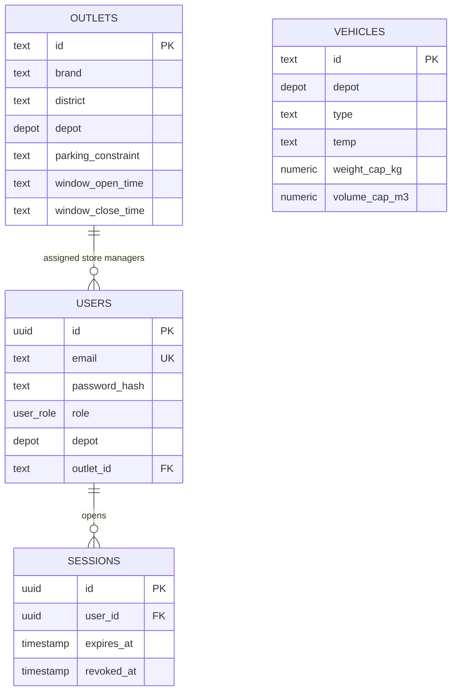

# Stage 1 data model

`outlets` and `vehicles` preserve supplied IDs such as `OUT001` and `VEH053`. `users.email` is unique without case sensitivity. A store manager's outlet is a foreign key. Vehicle assignment is not a user attribute: later stages will associate drivers, vehicles, and trips with a dated plan. Session rows give logout immediate revocation.

Future order records must retain scenario/date and source order reference together; future trip uniqueness must include plan/date, vehicle, and trip number. This avoids blocking use of the same fleet on subsequent operating days.
